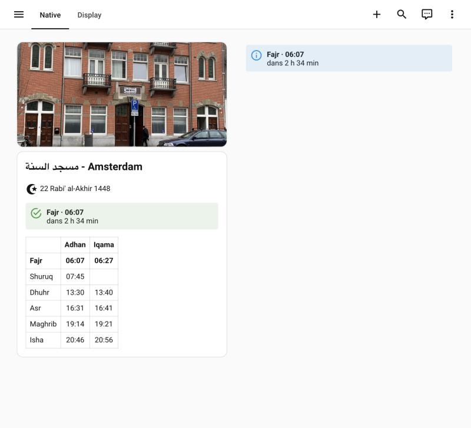
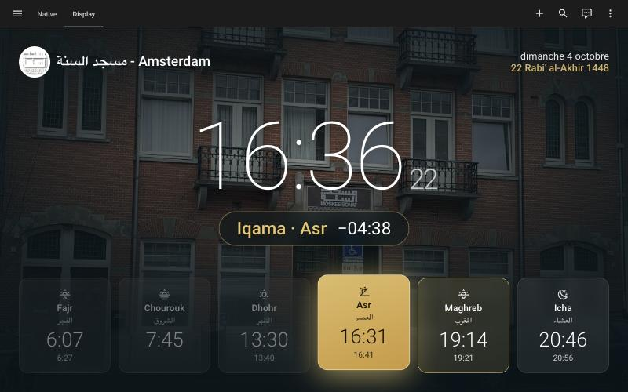
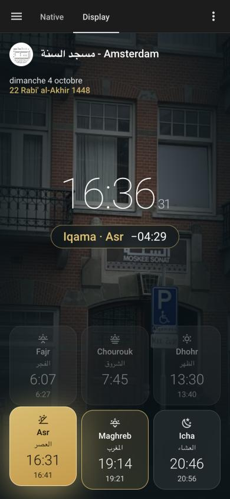

# Dashboards voor MAWAQIT

[English](dashboards.md) | [Français](dashboards.fr.md) | [Deutsch](dashboards.de.md) | **Nederlands**

Drie voorbeelden om in je dashboards te plakken:

- [Gebedstijdenkaart](#gebedstijdenkaart): de foto van je moskee, de Hijri-datum van vandaag, het volgende gebed en de adhan en iqama van elk gebed. Alleen ingebouwde kaarten.
- [Volgend gebed](#volgend-gebed): een kleine kaart met het volgende gebed en de resterende tijd. Alleen ingebouwde kaarten.
- [Moskeescherm](#moskeescherm): een schermvullende weergave zoals de schermen van je moskee, voor een tablet aan de muur. Hiervoor is [button-card](https://github.com/custom-cards/button-card) nodig, geïnstalleerd met HACS.

Een kaart toevoegen: open je dashboard, kies ✏️ **Dashboard bewerken** en daarna **Kaart toevoegen**. Zoek naar **Handmatig**, plak de YAML en kies **Opslaan**.

## Gebedstijdenkaart

<picture>
  <source media="(prefers-color-scheme: dark)" srcset="images/dashboards/prayer-times-card-dark.jpg">
  
</picture>

Het volgende gebed is vet en de gebeden die voorbij zijn, zijn grijs. Vóór Fajr toont de kaart de tijden van de dag die begint.

Vervang de entiteit-ID's bovenaan de kaart door de jouwe, zie [Entiteit-ID's](../README.nl.md#entiteit-ids). Publiceert je moskee geen foto, verwijder dan de kaart `picture-entity`. Publiceert ze geen iqama's, dan toont de kolom Iqama `–`.

```yaml
type: vertical-stack
cards:
  - type: picture-entity
    entity: image.my_mosque_picture
    show_name: false
    show_state: false
    aspect_ratio: "2:1"
  - type: markdown
    content: |-
      
      
      
      
      
      
      
      {{ as_timestamp(states(entity), none) | timestamp_custom('%H:%M', default='–') if entity else '' }}
      
      
      
      ## {{ device_attr(device_id(next_name), 'name') }}
      <ha-icon icon="mdi:star-crescent"></ha-icon> {{ states(hijri_day) }} {{ state_translated(hijri_month) }} {{ states(hijri_year) }}

      <ha-alert alert-type="success" title="{{ state_translated(next_name) }} · {{ hm(next_time) }}">over {{ left // 3600 }} h {{ '%02d' | format(left % 3600 // 60) }} min</ha-alert>

      | | Adhan | Iqama |
      |:--|:-:|:-:|
      
      
      
      | **{{ cells | join('** | **') }}** |
      
      | <font color="gray">{{ cells | join('</font> | <font color="gray">') }}</font> |
      
      | {{ cells | join(' | ') }} |
      
      
```

## Volgend gebed

```yaml
type: markdown
text_only: true
content: |-
  
  
  
  <ha-alert alert-type="info" title="{{ state_translated(next_name) }} · {{ as_timestamp(states(next_time), 0) | timestamp_custom('%H:%M') }}">over {{ left // 3600 }} h {{ '%02d' | format(left % 3600 // 60) }} min</ha-alert>
```

Vervang de twee entiteit-ID's door de jouwe.

## Moskeescherm

 

De klok, de datum van vandaag en de Hijri-datum, en de zes tijden van de dag met hun iqama, op de foto van je moskee. Het volgende gebed is goud, en tussen de adhan en de iqama telt het scherm af tot de iqama. Op vrijdag wordt Dhuhr vervangen door Jumu'a als je moskee die publiceert. De namen van de gebeden zijn in de taal van Home Assistant.

Er zijn geen entiteit-ID's te vervangen: de kaart vindt de entiteiten van je moskee zelf. Volg je meerdere moskeeën, zet `mosque` dan op de naam van het apparaat van de moskee die je wilt tonen.

1. Installeer **button-card** met HACS: open **HACS**, zoek naar **button-card**, kies **Downloaden** en herlaad daarna de pagina in je browser. Versie 7 vereist Home Assistant 2025.10 of nieuwer; de kaart is getest met versie 7.0.1.
2. Open je dashboard, kies ✏️ **Dashboard bewerken** en daarna ➕ om een weergave toe te voegen. Kies bij **Indeling** **Paneel (één kaart)** en kies **Opslaan**.
3. Voeg in de nieuwe weergave een kaart **Handmatig** toe, plak de YAML hieronder en kies **Opslaan**.

```yaml
type: custom:button-card
variables:
  # The name of the mosque device, if you follow several mosques.
  mosque: ""
  # The entities of the mosque, found by their translation key: nothing to replace.
  entities: |
    [[[
      const own = Object.values(hass.entities).filter((e) => e.platform === "mawaqit");
      const device = variables.mosque
        ? Object.values(hass.devices).find((d) => [d.name_by_user, d.name].includes(variables.mosque))
        : hass.devices[own[0]?.device_id];
      if (!device) return undefined;
      return {
        name: device.name_by_user || device.name,
        ...Object.fromEntries(
          own.filter((e) => e.device_id === device.id).map((e) => [e.translation_key, e.entity_id])
        ),
      };
    ]]]
update_timer: 1000
show_name: false
show_icon: false
show_state: false
tap_action:
  action: none
styles:
  card:
    - height: calc(100vh - var(--header-height, 56px))
    - min-height: 480px
    - padding: 0
    - border: none
    - border-radius: 0
    - background: |
        [[[
          const url = states[variables.entities?.picture]?.attributes.entity_picture;
          const shade =
            "radial-gradient(ellipse at 50% 40%, rgba(8, 20, 24, 0.35), rgba(8, 20, 24, 0.85) 70%), " +
            "linear-gradient(180deg, rgba(8, 20, 24, 0.55), rgba(8, 20, 24, 0.2) 35%, rgba(8, 20, 24, 0.92))";
          return url ? `${shade}, center / cover no-repeat url("${url}") #0b1418` : `${shade}, #0b1418`;
        ]]]
    - color: white
  grid:
    - grid-template-areas: '"screen"'
    - grid-template-rows: 1fr
    - grid-template-columns: 1fr
    - height: 100%
  custom_fields:
    screen:
      - height: 100%
custom_fields:
  screen: |
    [[[
      const PRAYERS = [
        { key: "fajr", ar: "الفجر", icon: "mdi:weather-sunset-up" },
        { key: "shuruq", ar: "الشروق", icon: "mdi:weather-sunset" },
        { key: "dhuhr", ar: "الظهر", icon: "mdi:weather-sunny" },
        { key: "asr", ar: "العصر", icon: "mdi:sun-angle-outline" },
        { key: "maghrib", ar: "المغرب", icon: "mdi:weather-sunset-down" },
        { key: "isha", ar: "العشاء", icon: "mdi:weather-night" },
      ];

      const ids = variables.entities;
      if (!ids) return `<div class="empty">MAWAQIT: mosque not found</div>`;
      const state = (key) => {
        const s = states[ids[key]];
        return s && !["unknown", "unavailable"].includes(s.state) ? s : undefined;
      };
      const time = (key) => (state(key) ? new Date(state(key).state) : undefined);
      const hm = (date) => (date ? helpers.formatTime(date) : "—");
      const pad = (n) => String(n).padStart(2, "0");
      const escape = (text) =>
        String(text).replace(/[&<>"']/g, (c) => `&#${c.charCodeAt(0)};`);
      const countdown = (ms) => {
        const s = Math.max(0, Math.ceil(ms / 1000));
        const h = Math.floor(s / 3600);
        return (h ? `${h}:` : "") + `${pad(Math.floor((s % 3600) / 60))}:${pad(s % 60)}`;
      };

      const now = new Date();
      const nextKey = state("next_salat_name")?.state;
      const nextTime = time("next_salat_time");
      const nameStates = states[ids.next_salat_name];
      const label = (key) => (nameStates ? helpers.localize(nameStates, key) : key);

      // Jumu'a replaces Dhuhr on Fridays, when the mosque publishes it.
      const jumua = time("prayer_jumua");
      const isJumua = jumua && jumua.toDateString() === now.toDateString();

      let banner;
      const tiles = PRAYERS.map((p) => {
        let adhan = time(`prayer_${p.key}`);
        let iqama = time(`iqama_${p.key}`);
        // After Isha the sensors still show today's Fajr: show the next one.
        if (p.key === nextKey && nextTime && adhan && nextTime - adhan > 12 * 3600e3) {
          if (iqama) iqama = new Date(iqama.getTime() + (nextTime - adhan));
          adhan = nextTime;
        }
        let name = label(p.key);
        let ar = p.ar;
        if (p.key === "dhuhr" && isJumua) {
          name = "Jumu'a";
          ar = "الجمعة";
          adhan = jumua;
          iqama = undefined;
        }
        let status = "";
        if (adhan && iqama && adhan <= now && now < iqama) {
          status = "active";
          banner = { title: `Iqama · ${name}`, until: iqama, iqama: true };
        } else if (p.key === nextKey) {
          status = "next";
        } else if ((iqama ?? adhan) && (iqama ?? adhan) < now) {
          status = "past";
        }
        return `
          <div class="tile ${status}">
            <ha-icon icon="${p.icon}"></ha-icon>
            <div class="name">${name}</div>
            <div class="ar">${ar}</div>
            <div class="adhan">${hm(adhan)}</div>
            <div class="iqama">${iqama ? hm(iqama) : "&nbsp;"}</div>
          </div>`;
      }).join("");
      banner ??= nextKey && nextTime && { title: label(nextKey), until: nextTime };

      const logo = states[ids.logo]?.attributes.entity_picture;
      const hijri = state("hijri_day")
        ? `${state("hijri_day").state} ${helpers.localize(states[ids.hijri_month])} ${state("hijri_year")?.state ?? ""}`
        : "";

      // The flash message scrolls at a pace set by the clock, so redrawing every second does not restart it.
      const flash = state("flash_message");
      let ticker = "";
      if (flash) {
        const seconds = Math.max(15, flash.state.length / 3);
        const delay = -((Date.now() / 1000) % seconds);
        const dir = flash.attributes.direction === "rtl" ? "rtl" : "ltr";
        const color = /^#[0-9a-f]{3,8}$/i.test(flash.attributes.color) ? flash.attributes.color : "#1f6f5c";
        ticker = `
          <div class="flash" style="background: ${color}">
            <span dir="${dir}" class="${dir}" style="animation-duration: ${seconds}s; animation-delay: ${delay}s">${escape(flash.state)}</span>
          </div>`;
      }

      return `
        <div class="screen">
          <header>
            <div class="mosque">
              ${logo ? `` : `<ha-icon icon="mdi:mosque"></ha-icon>`}
              <span>${escape(ids.name)}</span>
            </div>
            <div class="dates">
              <div>${helpers.formatDateWeekdayDay(now)}</div>
              <div class="hijri">${hijri}</div>
            </div>
          </header>
          <main>
            <div class="clock">${helpers.formatTime(now)}<span>${pad(now.getSeconds())}</span></div>
            ${banner ? `<div class="countdown"><b>${banner.title}</b><span>−${countdown(banner.until - now)}</span></div>` : ""}
          </main>
          <footer class="${banner?.iqama ? "has-active" : ""}">${tiles}</footer>
          ${ticker}
        </div>`;
    ]]]
extra_styles: |
  .screen {
    position: relative;
    height: 100%;
    display: grid;
    grid-template-rows: auto 1fr auto auto;
    gap: 2vh;
    padding: clamp(16px, 3vw, 40px);
    box-sizing: border-box;
    overflow: hidden;
    text-align: left;
    font-variant-numeric: tabular-nums;
  }
  header { display: flex; justify-content: space-between; align-items: center; gap: 16px; }
  .mosque { display: flex; align-items: center; gap: 14px; font-size: clamp(18px, 2.2vw, 30px); font-weight: 500; }
  .mosque img { height: clamp(40px, 5vw, 64px); width: clamp(40px, 5vw, 64px); object-fit: contain; border-radius: 50%; background: white; padding: 4px; box-sizing: border-box; }
  .mosque ha-icon { --mdc-icon-size: clamp(32px, 4vw, 48px); color: #e9c46a; }
  .dates { text-align: right; font-size: clamp(14px, 1.6vw, 22px); opacity: 0.9; }
  .dates .hijri { color: #e9c46a; font-weight: 500; }
  main { display: flex; flex-direction: column; align-items: center; justify-content: center; text-shadow: 0 2px 24px rgba(0, 0, 0, 0.5); }
  .clock { font-size: clamp(72px, 15vw, 220px); font-weight: 200; line-height: 1; letter-spacing: -0.02em; }
  .clock span { font-size: 0.3em; font-weight: 300; margin-left: 0.15em; opacity: 0.7; }
  .countdown { margin-top: 2vh; display: flex; gap: 0.6em; align-items: baseline; font-size: clamp(20px, 2.8vw, 40px);
    padding: 0.35em 1em; border-radius: 999px; background: rgba(8, 20, 24, 0.55); border: 1px solid rgba(233, 196, 106, 0.55);
    backdrop-filter: blur(12px); -webkit-backdrop-filter: blur(12px); }
  .countdown b { color: #e9c46a; font-weight: 500; }
  footer { display: grid; grid-template-columns: repeat(6, 1fr); gap: clamp(8px, 1.2vw, 18px); }
  .tile {
    display: flex; flex-direction: column; align-items: center; gap: 0.2em;
    padding: clamp(10px, 1.6vw, 22px) 6px;
    border-radius: 20px;
    background: rgba(255, 255, 255, 0.08);
    border: 1px solid rgba(255, 255, 255, 0.14);
    backdrop-filter: blur(14px);
    -webkit-backdrop-filter: blur(14px);
  }
  .tile ha-icon { --mdc-icon-size: clamp(20px, 2vw, 28px); opacity: 0.8; }
  .tile .name { font-size: clamp(14px, 1.5vw, 22px); font-weight: 500; }
  .tile .ar { font-size: clamp(13px, 1.3vw, 19px); opacity: 0.7; }
  .tile .adhan { font-size: clamp(24px, 3.2vw, 48px); font-weight: 300; }
  .tile .iqama { font-size: clamp(13px, 1.3vw, 19px); opacity: 0.75; }
  .tile.past { opacity: 0.45; }
  .tile.next, .tile.active {
    background: linear-gradient(160deg, rgba(233, 196, 106, 0.95), rgba(214, 160, 60, 0.95));
    border-color: rgba(255, 236, 190, 0.8);
    color: #1b1408;
    box-shadow: 0 10px 40px rgba(233, 196, 106, 0.35);
    transform: translateY(-6px);
  }
  .tile.next ha-icon, .tile.active ha-icon, .tile.next .ar, .tile.active .ar, .tile.next .iqama, .tile.active .iqama { opacity: 0.85; }
  .tile.active { box-shadow: 0 10px 60px rgba(233, 196, 106, 0.7); }
  .has-active .tile.next {
    background: rgba(233, 196, 106, 0.14);
    border-color: rgba(233, 196, 106, 0.8);
    color: white;
    box-shadow: none;
    transform: none;
  }
  .flash { overflow: hidden; white-space: nowrap; border-radius: 12px; padding: 0.4em 0; font-size: clamp(16px, 2vw, 28px);
    font-weight: 500; text-shadow: 0 1px 2px rgba(0, 0, 0, 0.4); }
  .flash span { display: inline-block; padding-left: 100%; animation: ticker linear infinite; }
  .flash span.rtl { animation-name: ticker-rtl; }
  @keyframes ticker { to { transform: translateX(-100%); } }
  @keyframes ticker-rtl { from { transform: translateX(-100%); } to { transform: translateX(0); } }
  .empty { display: grid; place-items: center; height: 100%; font-size: 32px; }
  @media (max-width: 700px) {
    footer { grid-template-columns: repeat(3, 1fr); }
    header { flex-direction: column; align-items: flex-start; }
    .dates { text-align: left; }
  }
```

Open de weergave op een wandtablet schermvullend in de browser, of gebruik [kiosk-mode](https://github.com/NemesisRE/kiosk-mode) om de kopbalk en de zijbalk te verbergen.
